# 无人自助酒店用户端app
## 项目简介
本项目是一个无人自助酒店用户端app(小程序)，用户可以通过app预定酒店房间，入住酒店房间，办理入住，一键开门，退房等操作。
## 项目说明
完整的项目由四部分组成，分别是用户端app(小程序)，酒店管理商家端app(小程序)，后台管理系统(网页)，酒店一体机系统。
功能：
- 用户端app(小程序)：用户可以通过app预定酒店房间，入住酒店房间，办理入住，一键开门，退房，房间打扫，退房提醒等操作。
- 酒店管理商家端app(小程序)：酒店管理人员可以通过app管理酒店房态，查看订单，修改订单信息，退房，退押金，房价修改，一键开门，收益走势与结算等操作。
- 后台管理系统(网页)：对用户、酒店、订单、门锁、公安系统模块管理。
- 酒店一体机系统：酒店一体机系统是一个硬件设备，可以用于办理入住，退房，续房， 一键开门等操作。
  本项目开源的是用户端app(小程序)的部分。其他部分暂不开源，如对项目感兴趣或者想完整体验请私聊我🛰️EnigmaGuest,备注来来源github。
## 项目技术栈
使用uniapp cli方式进行开发，vue2版本。
## 项目部分截图
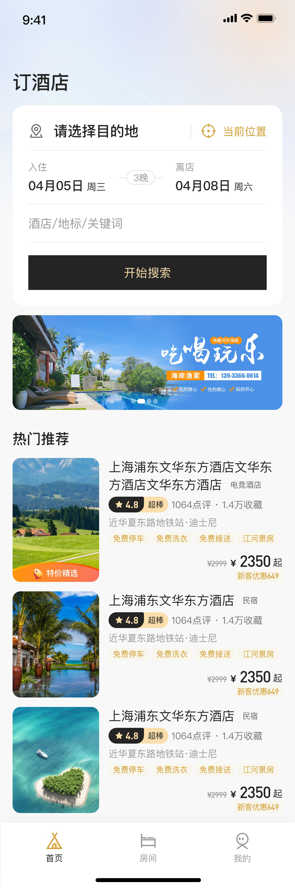
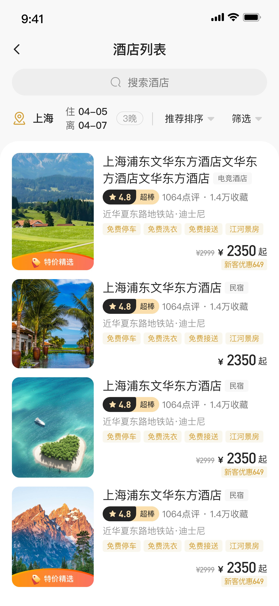
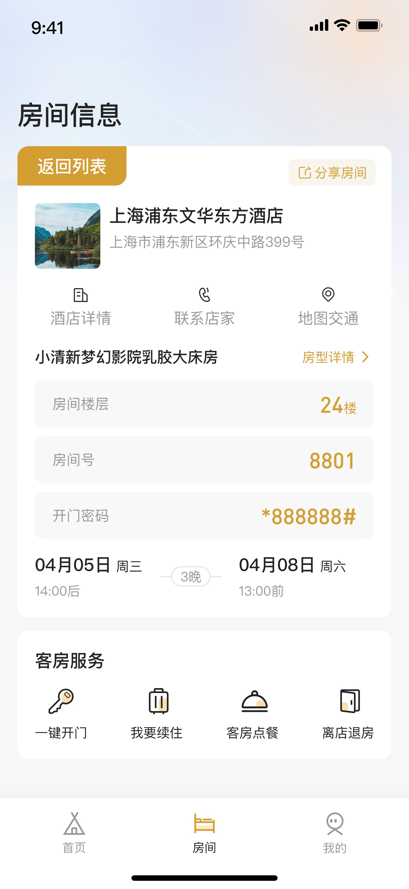
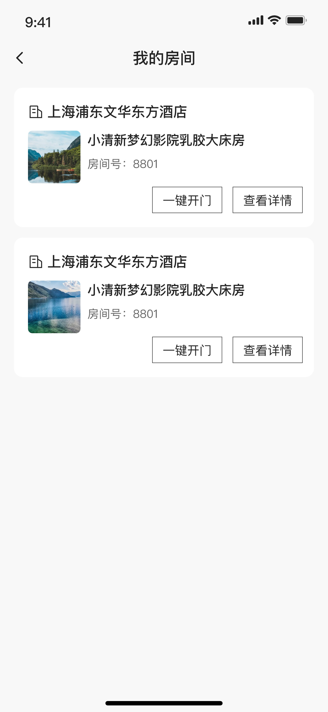
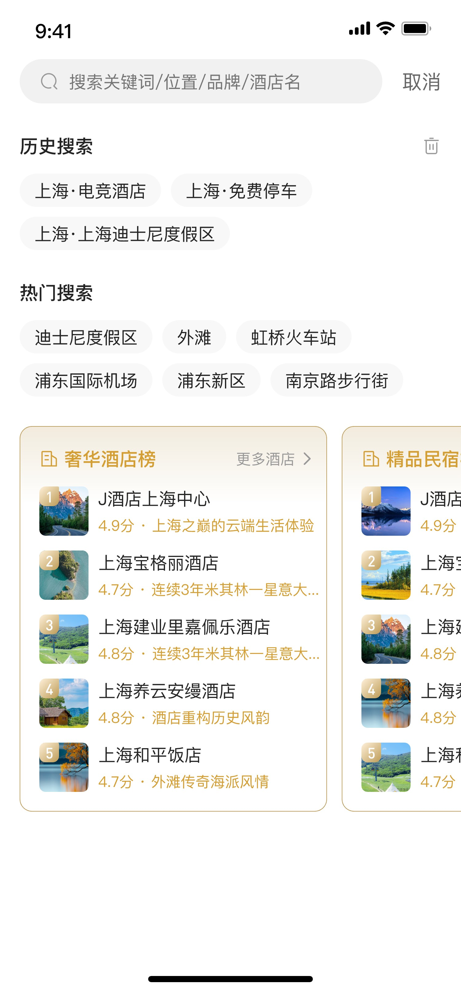
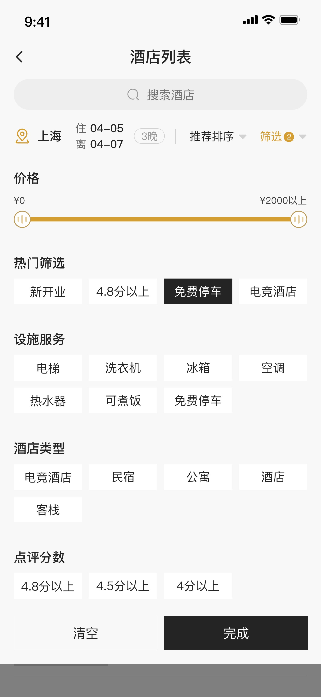
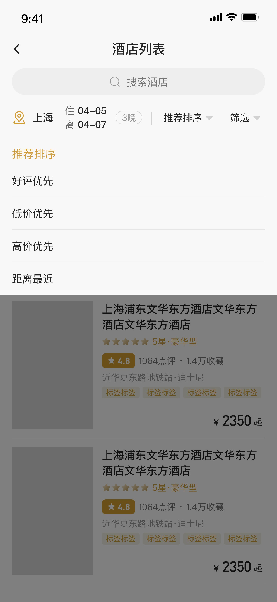

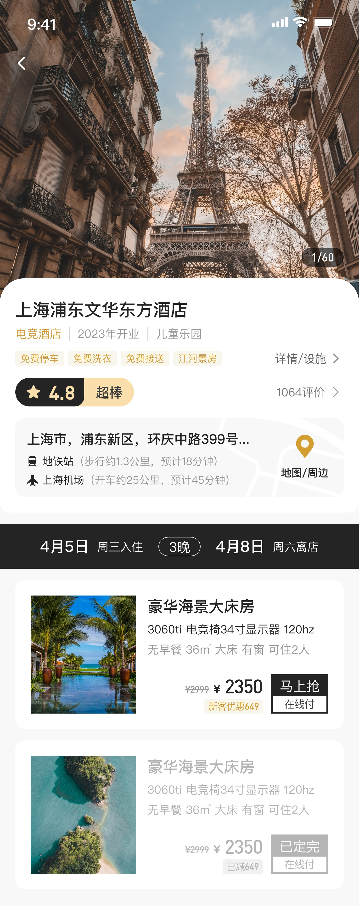
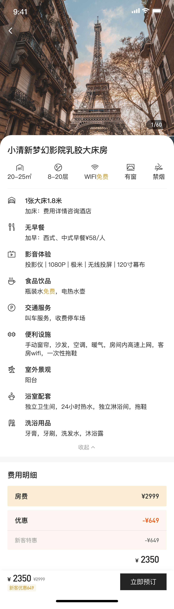
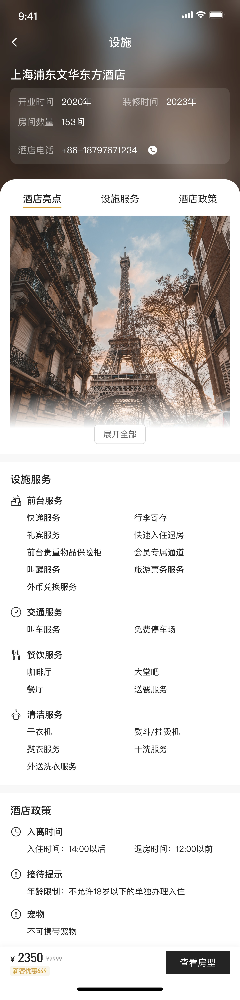
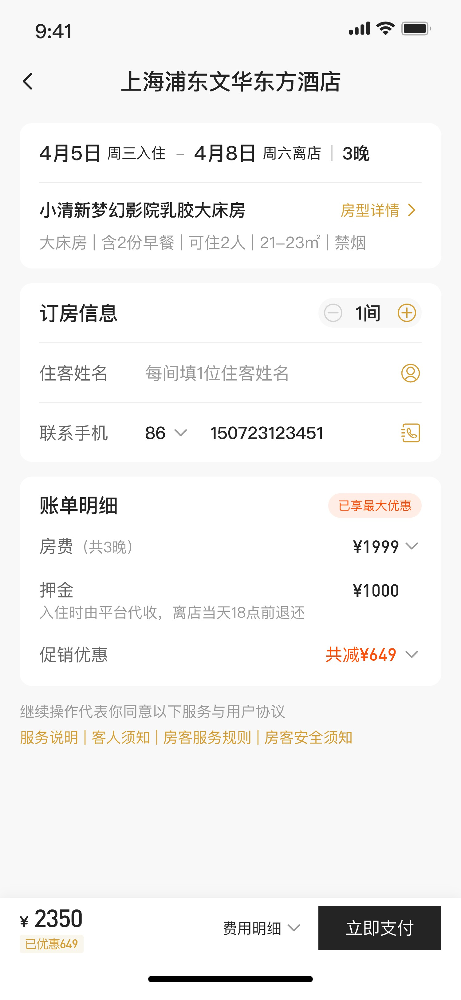
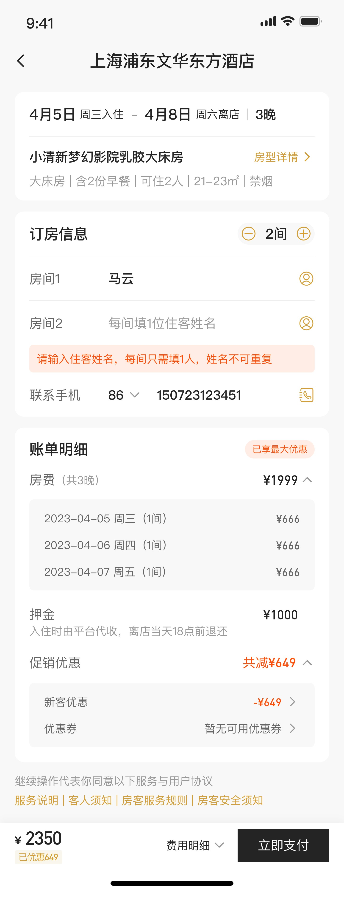
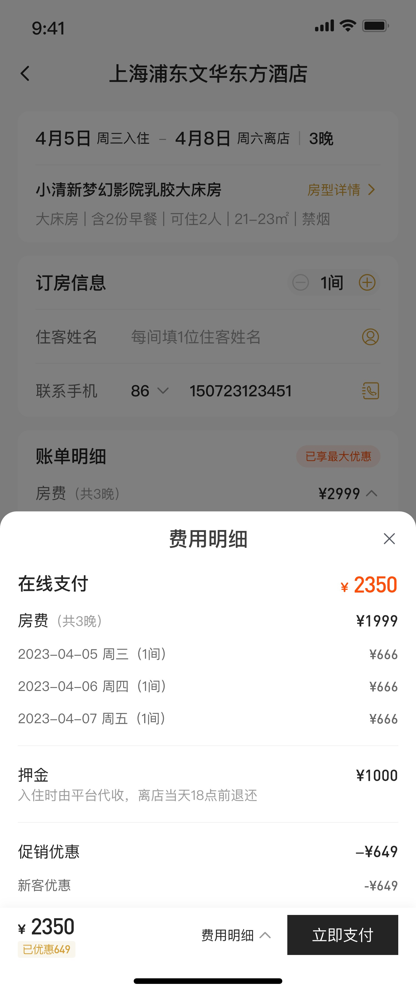
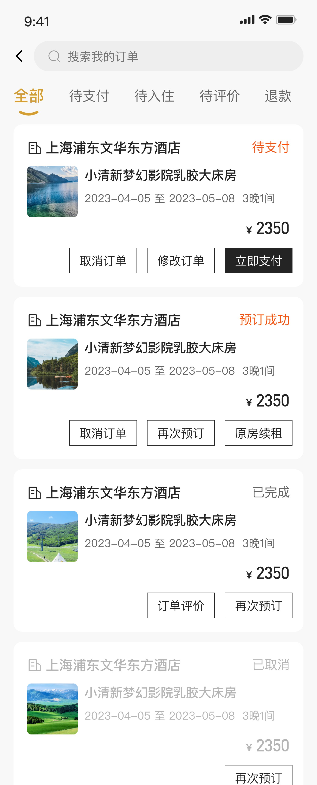
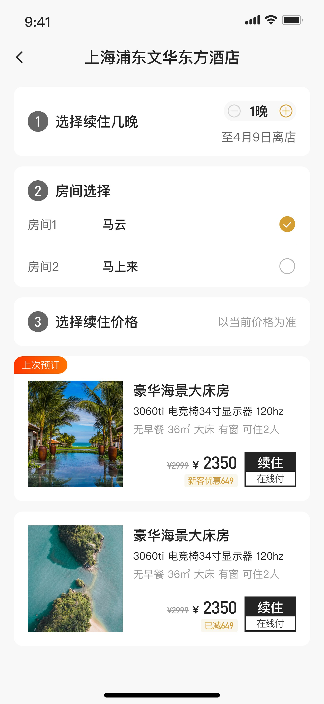
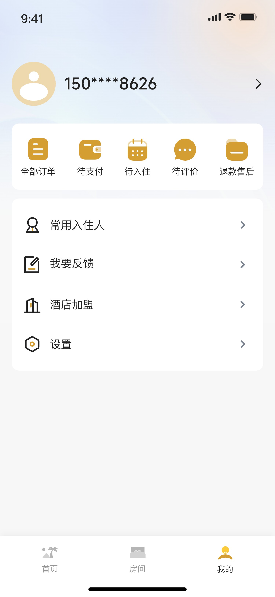
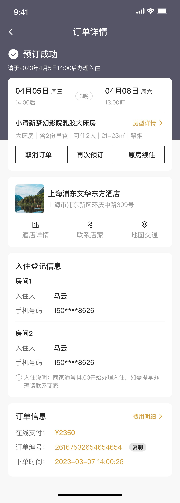

